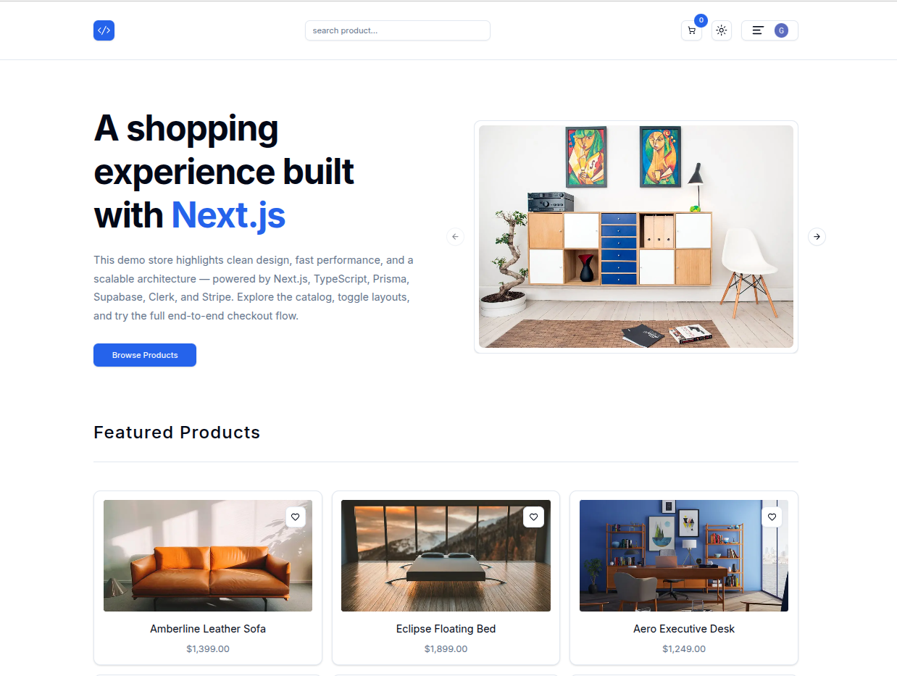
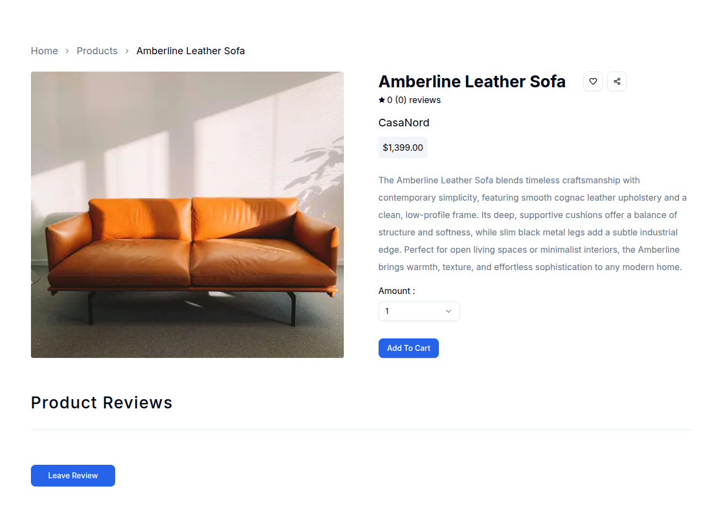
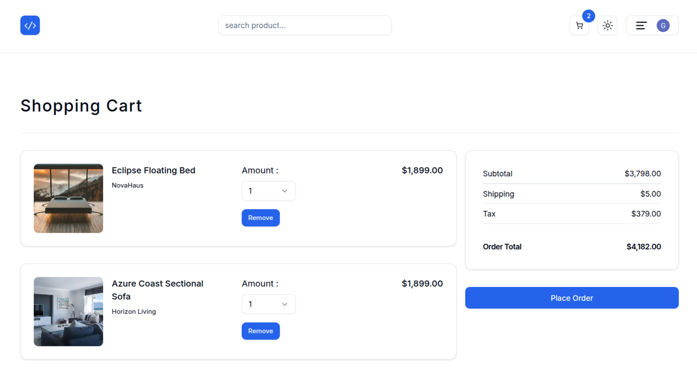
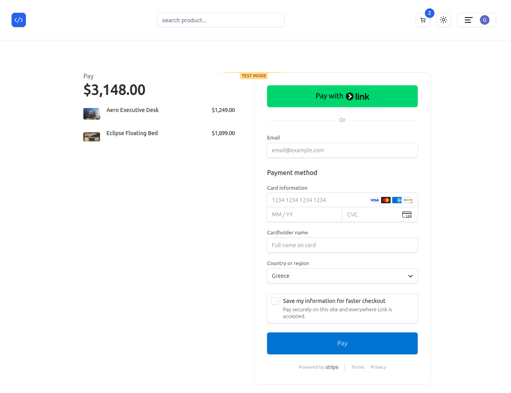
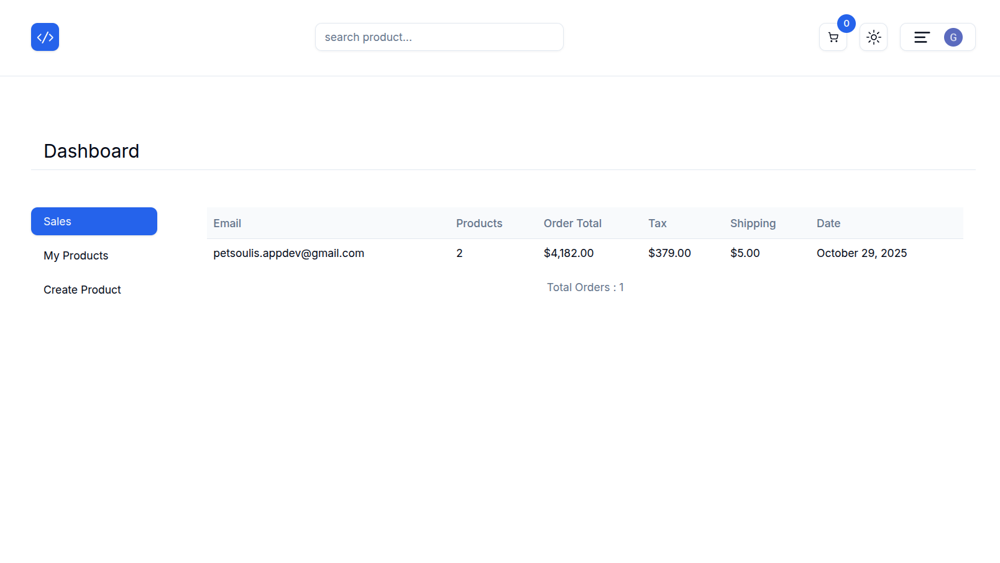
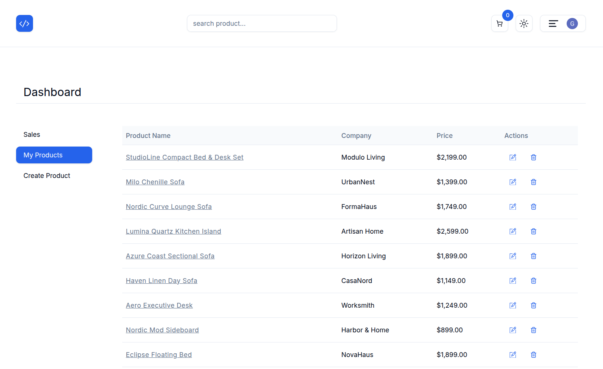
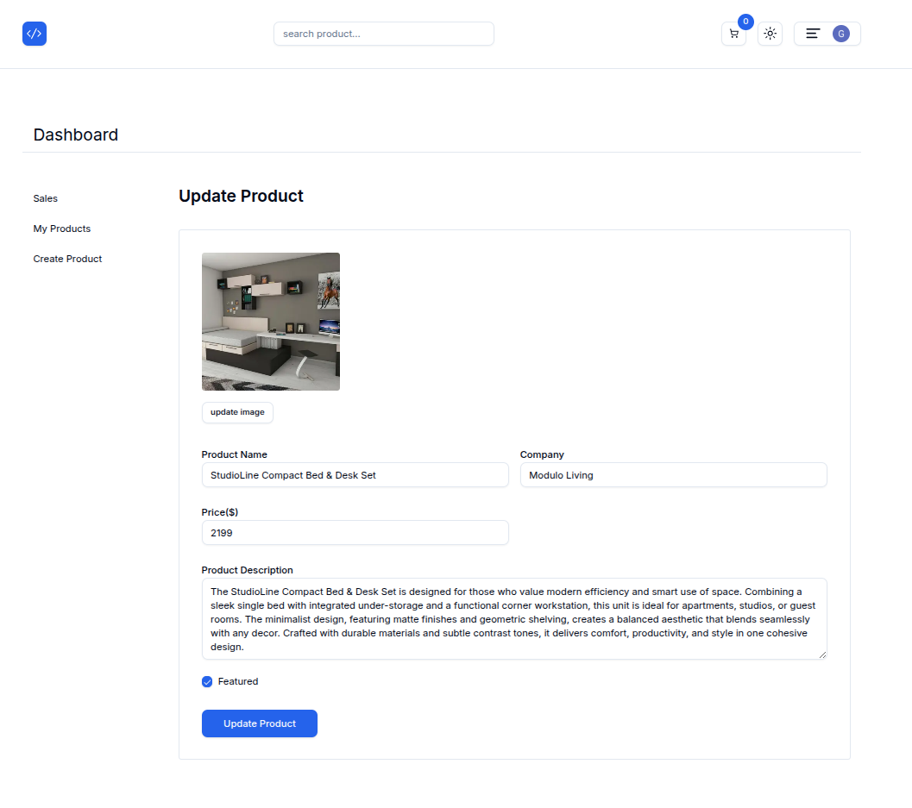
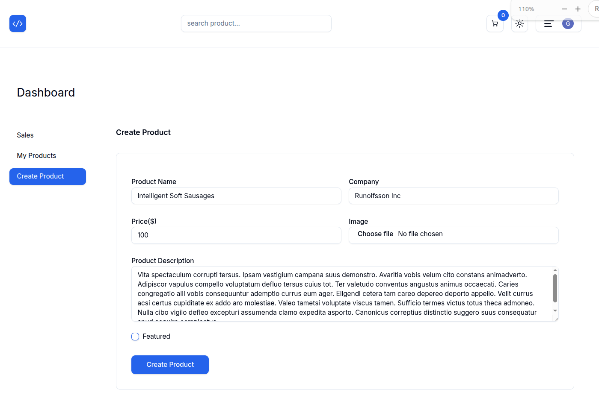

# 🛍️ Next.js E-Commerce Store

<div align="center">
  
  
  
  
  
  
  
  
  
  
</div>

<br/>

A **full-stack e-commerce demo** built to learn and explore **Next.js** and modern full-stack development.  
This project is part of my ongoing journey as a web developer, combining real-world architecture with a polished user experience.

> 🟢 **Live Demo**: [nextjs-ecommerce-store-iota.vercel.app](https://nextjs-ecommerce-store-iota.vercel.app)

---

## 📑 Table of Contents

- [🧭 Overview](#-overview)
- [⚙️ Features](#️-features)
- [📦 Tech Stack](#-tech-stack)
- [📌 Implementation Notes](#-implementation-notes)
- [📸 Project Preview](#-project-preview)
- [🗂️ Project Structure](#-project-structure)
- [💻 Getting Started](#-getting-started)
- [🔐 Environment Variables](#-environment-variables)
- [📜 Scripts](#-scripts)
- [🧠 What I Learned](#-what-i-learned)
- [🗓️ Changelog](#-changelog)
- [📚 Resources & Documentation](#-resources--documentation)
- [🚀 Deployment & CI](#-license)
- [📄 License](#-license)
- [🙏 Acknowledgments](#-acknowledgments)

---

## 🧭 Overview

This is a fully functional, full-stack **e-commerce web application** built with **Next.js 14 App Router** features.  
The project was developed entirely from scratch as part of a guided learning journey, following a structured course curriculum.

It showcases a realistic architecture that includes:

- **Server Actions**
- **Relational data modeling** with Prisma and Supabase
- **Authentication** powered by Clerk
- **Secure payments** via Stripe Embedded Checkout
- A polished UI built with **shadcn/ui**, including theming and carousel components

The goal of this project is to demonstrate practical skills in building scalable, maintainable, and visually clean full-stack web applications.

---

## ⚙️ Features

### 🛍️ User Experience

- Fully responsive layout with **dark/light theme support**
- Product browsing with **grid/list toggle**, **debounced search**, and featured items
- Product detail pages include **Favorites**, **Reviews**, and **average ratings**
- Authentication via **Clerk**, with real-time cart count in the navbar
- Persistent cart → Order flow → **Stripe Embedded Checkout** (test mode)

### 🧑‍💼 Admin Dashboard

- Admin interface for **listing, creating, editing, and deleting** products
- **Image upload** to Supabase Storage with auto-deletion of replaced images
- **Zod-based validation** for all product form fields, including images
- Order history and status tracking for admin users

### 🧠 Backend & Logic

- **Prisma models** for `Product`, `Favorite`, `Review`, `Cart`, `CartItem`, and `Order`
- Server Actions handle product CRUD, cart math, reviews, checkout, and order management
- Stripe routes manage payment sessions and confirmation
- Cart auto-clears after successful payment

<pre>

Clerk User
   │
   ├── Product
   │     ├── Favorite
   │     └── Review
   │
   ├── Cart
   │     └── CartItem → Product
   │
   └── Order

</pre>

---

## 🧰 Tech Stack

| Technology                     | Purpose                                                      | Docs                                                                                         |
| ------------------------------ | ------------------------------------------------------------ | -------------------------------------------------------------------------------------------- |
| **Next.js 14**                 | Full-stack React framework (App Router, RSC, Server Actions) | [nextjs.org](https://nextjs.org/docs)                                                        |
| **TypeScript**                 | Type-safe development across frontend/backend                | [typescriptlang.org](https://www.typescriptlang.org/docs)                                    |
| **Tailwind CSS**               | Utility-first styling framework                              | [tailwindcss.com](https://tailwindcss.com/docs)                                              |
| **shadcn/ui**                  | Accessible UI components built on Radix                      | [ui.shadcn.com](https://ui.shadcn.com)                                                       |
| **Prisma**                     | ORM for relational data with PostgreSQL                      | [prisma.io/docs](https://www.prisma.io/docs)                                                 |
| **Supabase**                   | PostgreSQL + Storage for product data and image uploads      | [supabase.com/docs](https://supabase.com/docs)                                               |
| **Clerk**                      | Authentication and user management                           | [clerk.dev/docs](https://clerk.dev/docs)                                                     |
| **Zod**                        | Schema-based form and input validation                       | [zod.dev](https://zod.dev)                                                                   |
| **Stripe**                     | Embedded Checkout for payments                               | [stripe.com/docs](https://stripe.com/docs/checkout)                                          |
| **Radix UI**                   | UI primitives used in shadcn/ui                              | [radix-ui.com](https://www.radix-ui.com/docs/primitives)                                     |
| **react-icons / lucide-react** | Icon libraries for UI                                        | [react-icons](https://react-icons.github.io/react-icons/), [lucide.dev](https://lucide.dev/) |
| **use-debounce**               | Debounced inputs for search performance                      | [use-debounce](https://www.npmjs.com/package/use-debounce)                                   |
| **Axios**                      | HTTP requests to internal API routes                         | [axios-http.com](https://axios-http.com/docs/intro)                                          |

---

## 📝 Implementation Notes

- **Carousel:** Built using the `shadcn/ui` Carousel component with local image slides and navigation controls.
- **Icons:** Implemented with `react-icons` for the navbar logo and `lucide-react` for product ratings (stars).
- **Form Validation:** Powered by `Zod`, including image file validation (type, size) with reusable schema helpers and custom error messages.
- **Image Handling:** Product images are stored in **Supabase Storage**, with automatic deletion of old files during updates.
- **Cart & Orders:** Cart updates in real time; all totals are recalculated server-side to ensure consistency across sessions.
- **Stripe Payments:** Integrated with **Stripe Embedded Checkout** — flow includes session creation, confirmation, cart cleanup, and user redirection.

---

## 📸 Project Preview

> 🧑‍💼 Admin pages are not publicly accessible in the live demo, but shown here for reference.

<div align="center">
<h2 >🖼️ Demo Screens</h2>
<i>💡 Click any screenshot to view it in full resolution.</i>
</div>
<details close>
  <summary align="center"><strong>Click to expand screenshots 👇</strong></summary>
  <br/>
<table>
  <tr>
    <td align="center">
      <br/>
      <strong>Home Page</strong>
    </td>
    <td align="center">
      <br/>
      <strong>Product Detail</strong>
    </td>
  </tr>
  <tr>
    <td align="center">
      <br/>
      <strong>Shopping Cart</strong>
    </td>
    <td align="center">
      <br/>
      <strong>Stripe Checkout</strong>
    </td>
  </tr>
  <tr>
    <td align="center">
      <br/>
      <strong>Sales Dashboard</strong> 🛡️
    </td>
    <td align="center">
      <br/>
      <strong>My Products</strong> (Edit/Delete) 🛡️
    </td>
  </tr>
  <tr>
    <td align="center">
      <br/>
      <strong>Edit Product</strong> 🛡️
    </td>
    <td align="center">
      <br/>
      <strong>Create Product</strong> 🛡️
    </td>
  </tr>
</table>

</details>

---

## 🗂️ Project Structure

```bash
app/
  about/              # Static About page
  admin/              # Admin dashboard (sales, products, create/edit)
  api/                # API routes (payment, confirmation)
  cart/               # Cart UI + logic
  checkout/           # Embedded Stripe checkout
  favorites/          # User favorites page
  orders/             # Order tracking & admin order views
  products/           # Product grid, detail, search
  reviews/            # User reviews
  globals.css         # Tailwind + global styles
  layout.tsx          # Root layout with providers and theme
  page.tsx            # Main landing page
  providers.tsx       # Context providers
  themeprovider.tsx   # Theme switch logic (dark/light)

components/
  cart/               # Cart list, table, total display
  form/               # Input fields, buttons, image upload
  global/             # Reusable layout components (Container, Toaster, etc.)
  home/               # Hero section, Carousel, featured products
  navbar/             # Navbar, search, links
  products/           # Product display cards
  reviews/            # Star rating display
  single-product/     # Add to cart, breadcrumbs, rating stars
  ui/                 # Custom `shadcn/ui` components

prisma/
  schema.prisma       # Prisma schema (models)
  seed.js             # Script to seed products
  products.json       # Seed data

utils/
  actions.ts          # Server Actions (CRUD, cart, orders)
  db.ts               # Prisma client
  format.ts           # Price formatting utilities
  links.ts            # Static site links
  schemas.ts          # Zod schemas
  supabase.ts         # Supabase client
  types.ts            # TypeScript types

```

---

## 💻 Getting Started

Follow these steps to run the project locally:

```bash
# 1. Install project dependencies
npm install

# 2. Generate the Prisma client
npx prisma generate

# 3. Push Prisma schema to your Supabase PostgreSQL database
npx prisma db push

# 4. (Optional) Seed the database with demo products
node prisma/seed.js

# 5. Start the development server
npm run dev

# App runs at:
http://localhost:3000
```

💡 Make sure you have a Supabase project and a Clerk application set up before running the app.

## 🔐 Environment Variables

Create two configuration files in your project root:

`.env` (for backend + 3rd-party integrations)

```
# PostgreSQL (Supabase)
DATABASE_URL=your-supabase-postgres-url
DIRECT_URL=your-direct-prisma-url

# Supabase Storage & API
SUPABASE_URL=your-supabase-project-url
SUPABASE_KEY=your-service-role-key

# Stripe Checkout
NEXT_PUBLIC_STRIPE_PUBLISHABLE_KEY=your-stripe-pk
STRIPE_SECRET_KEY=your-stripe-sk

# Admin User (Clerk User ID)
ADMIN_USER_ID=your-clerk-admin-user-id

# Site URL (used for redirects, metadata, sharing)
NEXT_PUBLIC_WEBSITE_URL=http://localhost:3000

```

`.env.local` (for Clerk authentication)

```
# Clerk Authentication
NEXT_PUBLIC_CLERK_PUBLISHABLE_KEY=your-clerk-publishable-key
CLERK_SECRET_KEY=your-clerk-secret-key
```

🔒 Security Tip: Both `.env` and `.env.local` should be added to `.gitignore` and never committed to Git.

---

## 📜 Scripts

```json
{
  "dev": "next dev", // Start the development server
  "build": "npx prisma generate && next build", // Generate Prisma client and build the app
  "start": "next start", // Start the production server
  "lint": "next lint" // Run ESLint for code quality checks
}
```

💡 Tip: Use `npm run <script>`to execute any of these.

---

## 📌 Exact Versions

This project was built and tested using the exact versions listed in [`package.json`](./package.json).  
For best compatibility, use the same versions when installing dependencies.

---

## 🎓 What I Learned

This was my **first project built with Next.js**, and it served as a deep dive into the framework's fundamentals and full-stack capabilities.  
I followed a structured curriculum but built the app from scratch, giving me hands-on experience in all layers of the stack.

- Learned the **fundamentals of Next.js 14** with **App Router** and **Server Actions**
- Designed and managed **relational data** using **Prisma** + **Supabase**
- Integrated **Clerk** for user authentication and admin access
- Used **Zod** for schema-based form validation, including image file checks
- Built a full **checkout flow with Stripe Embedded Checkout** (session → confirm → cleanup)
- Developed a reusable, scalable **UI system** using **shadcn/ui** and **Radix primitives**
- Improved my understanding of project architecture, error handling, and developer experience

---

## 🚀 Deployment & CI

This project is deployed using **Vercel** with **continuous deployment** enabled.  
Every commit to the `main` branch triggers an automatic deployment.

To prevent deployment for specific commits (e.g. minor README updates),  
I configured a custom **Ignore Build Step** in Vercel settings using the following script:

```bash
git log -1 --pretty=%B | grep -qi '\[skip ci\]' && exit 0 || exit 1
```

---

## 📄 License

This project was created for educational purposes as part of a React learning journey.  
This project is licensed under the MIT License.  
See the [LICENSE](LICENSE) file for details.

---

## 🙏 Acknowledgments

Special thanks to [John Smilga](https://johnsmilga.com/)  
for the original course, project idea, and design inspiration that guided this build.
